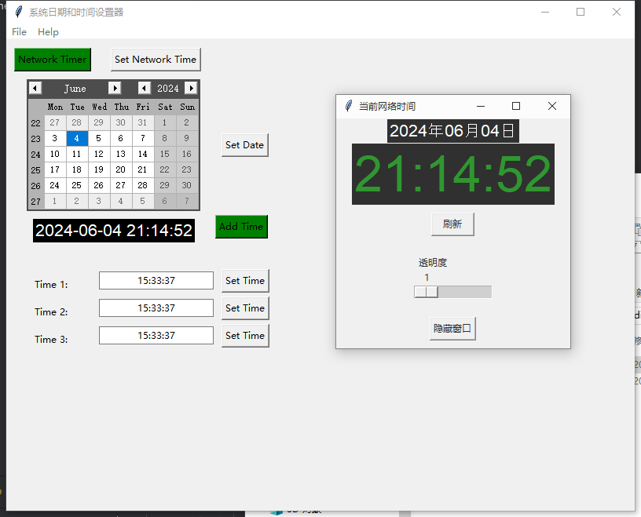

# network_clock

网络时钟，并提供系统日期和时间修改。

a network clock, it shows time from network time. It can also modify system date and time.

网络时间时钟，当本机时间修改后，显示网络时钟。并且可以修改系统的日期和时间。

## run
```bash
python main.py
```

## package
```bash
package.bat
```
generate a exe 'dist/main.exe'

## interface



